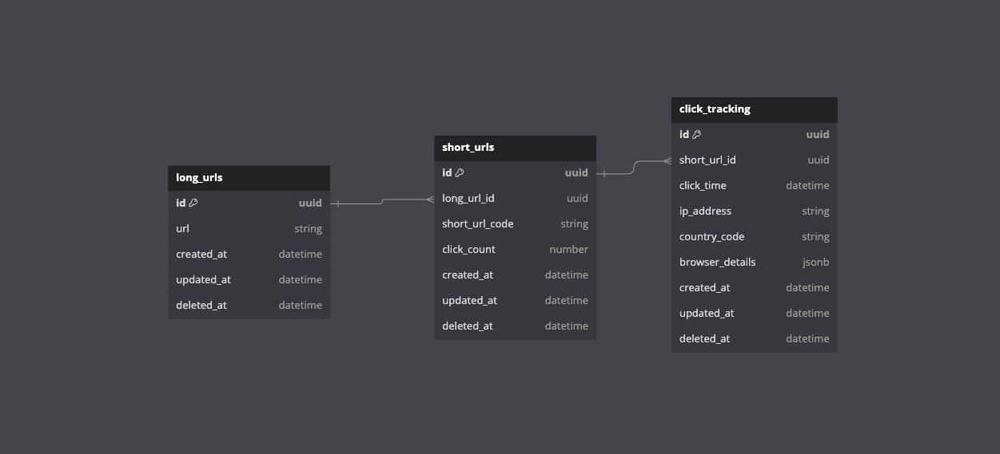
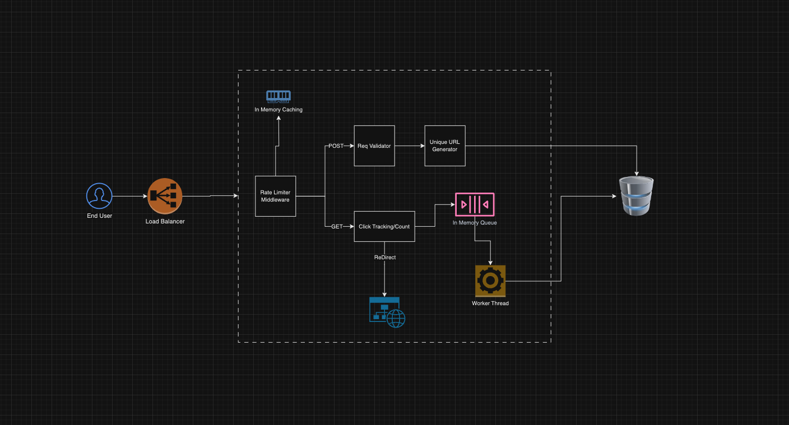

# URL Shortening Service (VivekBaskHealth)

This project is a URL Shortening Service, similar to popular services like Bit.ly. It allows users to create short URLs that redirect to longer, original URLs. The service is built with Node.js, TypeScript, and MySQL, leveraging best practices for scalability, performance, and security. [Link to Explainer Video](https://drive.google.com/file/d/1UqV_NStdKaCQ2FFsdokZJJqPFoO9T3Qz/view?usp=sharing)

## Table of Contents

1. [Overview](#overview)
2. [Features](#features)
3. [Tech Stack](#tech-stack)
4. [Setup and Installation](#setup-and-installation)
5. [API Endpoints](#api-endpoints)
6. [Database Schema](#database-schema)
7. [System Design](#system-design)
8. [Implementation Details](#implementation-details)
9. [Usage](#usage)
10. [Project Structure](#project-structure)
11. [Future Enhancements](#future-enhancements)

## Overview

The URL Shortening Service allows users to generate short, unique URLs that redirect to specified long URLs. This service is designed to handle a large number of requests efficiently and ensure that short URLs are unique. It includes features for tracking clicks, managing duplicate short URLs, and providing robust input sanitization. The service also implements rate limiting to prevent abuse and uses worker threads for batch processing to optimize performance.

## Features

- **Create Short URLs**: Generate unique short URLs for long URLs.
- **Redirect Short URLs**: Automatically redirect users from a short URL to the corresponding long URL.
- **Track Clicks**: Record detailed click data, including IP addresses, timestamps, and browser information.
- **Sanitize Input**: Ensure all domain inputs are properly sanitized to prevent malicious usage.
- **Handle Duplicates**: Efficiently manage duplicates with minimal database queries.
- **Rate Limiting**: Prevent abuse by limiting the number of API requests a user can make within a given time frame.
- **In-Memory Queue with Worker Threads**: Use an in-memory queue and worker threads to batch process click count updates and tracking queries for optimized performance.
- **Scalable**: Designed to handle a large scale of URL creation and redirection requests.

## Tech Stack

- **Node.js**: JavaScript runtime environment used for server-side scripting.
- **TypeScript**: Typed superset of JavaScript that compiles to plain JavaScript.
- **Express**: Web framework for building RESTful APIs.
- **MySQL**: Relational database management system used for storing URL mappings and click data.
- **UUID**: Library for generating UUIDs for unique identifiers.
- **Crypto**: Built-in Node.js module for cryptographic functions.
- **Dotenv**: Module to load environment variables from a `.env` file.
- **Cors**: Node.js package for enabling Cross-Origin Resource Sharing.
- **Geoip-lite**: Module for fast IP geolocation.
- **Joi**: Schema description language and data validator for JavaScript.
- **Moment**: Parse, validate, manipulate, and display dates and times in JavaScript.
- **Morgan**: HTTP request logger middleware for Node.js.
- **Nodemon**: Utility that monitors for any changes in your source and automatically restarts your server.
- **Useragent**: Parser for HTTP user agent strings.
- **mysql2**: MySQL client for Node.js, supporting prepared statements.
- **Worker Threads**: Node.js module that enables multithreading for running JavaScript in parallel.

## Setup and Installation

### Prerequisites

- **Node.js**: Ensure you have Node.js installed. You can download it from [Node.js official website](https://nodejs.org/).
- **MySQL**: Install MySQL Server and ensure it is running. You can download it from [MySQL official website](https://www.mysql.com/).

### Installation Steps

1. **Clone the Repository**

   ```bash
   git clone https://github.com/fazenecture/VivekBaskHealth.git
   cd VivekBaskHealth
   ```

2. **Install Dependencies**

   Install the required npm packages:

   ```bash
   npm install
   ```

3. **Configure Database**

   - Create a MySQL database named `url_shortener`.
   - Run the SQL scripts in the `schema.sql` file to set up the required tables.

4. **Set Up Environment Variables**

   Create a `.env` file in the root directory with the following configuration:

   ```
   DB_HOST=localhost
   DB_USER=your_mysql_user
   DB_PASSWORD=your_mysql_password
   DB_NAME=url_shortener
   PORT=3000
   TIME_WINDOW=60000
   MAX_REQUESTS=10
   MAX_DUPLICATE_ATTEMPT=5
   DOMAIN=http://localhost:4000
   ```

5. **Start the Server**

   Start the Node.js server:

   ```bash
   npm run dev
   ```

   The server will run on the port specified in your `.env` file.

## API Endpoints

### 1. **Create a Short URL**

- **Endpoint**: `/shorten`
- **Method**: `POST`
- **Description**: Creates a short URL for the given long URL.
- **Request Body**:
  ```json
  {
    "url": "https://www.example.com"
  }
  ```
- **Response**:
  ```json
  {
    "success": true,
    "message": "Shortened URL generated successfully",
    "data": "http://localhost:4000/sOFj5re"
  }
  ```

### 2. **Redirect to Long URL**

- **Endpoint**: `/:short_url`
- **Method**: `GET`
- **Description**: Redirects to the original long URL associated with the given short URL.

## Database Schema

The database schema consists of two main tables:



1. **`long_urls`**: Stores the original long URLs.

   - `id`: UUID (Primary Key)
   - `url`: String
   - `created_at`: Datetime
   - `updated_at`: Datetime
   - `deleted_at`: Datetime

2. **`short_urls`**: Maps short URLs to long URLs.

   - `id`: UUID (Primary Key)
   - `long_url_id`: UUID (Foreign Key)
   - `short_url_code`: String (Unique)
   - `click_count`: Number
   - `created_at`: Datetime
   - `updated_at`: Datetime
   - `deleted_at`: Datetime

3. **`click_tracking`**: Logs click data for each short URL.
   - `id`: UUID (Primary Key)
   - `short_url_id`: UUID (Foreign Key)
   - `click_time`: Datetime
   - `ip_address`: String
   - `country_code`: String
   - `browser_details`: JSONB
   - `created_at`: Datetime
   - `updated_at`: Datetime
   - `deleted_at`: Datetime

## System Design



The backend service is built using a modular architecture with the following components:

- Express: For handling HTTP requests and routing.
- Worker Threads: For offloading CPU-intensive tasks and handling background
  operations.
- MySQL: For storing URL mappings, click analytics, and rate-limiting data.
- In-Memory Queue: For temporarily storing tasks before processing them in batches.

### Queue Working

1. **Main Queue**: Tasks are initially added to the main queue for processing.
2. **Worker Thread**: A worker thread processes the tasks in the main queue. If a task fails, it sends a failure message back to the main thread.
3. **Retry Queue**: Failed tasks are moved to the retry queue and are reprocessed after a delay.

### Retry Mechanism

The service includes a robust retry mechanism to handle failures in processing tasks. When a task fails due to a transient error (e.g., temporary database outage), it is moved to a retry queue. The retry queue is processed after a specified interval, allowing for retrying failed operations.

## Implementation Details

- **Domain Sanitization**: The service includes a domain sanitization function that removes any unwanted characters and ensures that the domain is valid.
- **Efficient Duplicate Handling**: Uses `INSERT IGNORE` to manage duplicates efficiently and minimize query costs.
- **UUID for Unique Identifiers**: Uses UUIDs for `id` fields to ensure global uniqueness across all entries.
- **Rate Limiting**: Implemented using in-memory caching to prevent abuse and ensure fair usage.
- **In-Memory Queue with Worker Threads**: Utilizes an in-memory queue with worker threads to batch process click count updates and tracking queries, optimizing performance and reducing database load.
- **Tracking and Analytics**: Captures detailed analytics on URL clicks, including IP addresses, timestamps, and browser details.

## Usage

To use this URL Shortening Service, you can send HTTP requests to the API endpoints using tools like [Postman](https://www.postman.com/) or [Curl](https://curl.se/).

1. **Shorten a URL**: Send a `POST` request to `/shorten` with a `long_url` in the request body.
2. **Redirect**: Access the short URL in a browser or use a `GET` request to the short URL endpoint.

[Link To Postman Collection](https://documenter.getpostman.com/view/16301281/2sAXjF9ust)

## Project Structure

The project follows Domain-Driven Design (DDD), organizing code by domain. Below is the project structure:

```
├── scripts
│   └── schema.sql
├── src
│   ├── config
│   │   └── mysql.ts
│   ├── index.ts
│   ├── routes
│   │   └── index.routes.ts
│   ├── shortener
│   │   ├── controller.ts
│   │   ├── db.ts
│   │   ├── helper.ts
│   │   ├── limiter.ts
│   │   ├── middleware.ts
│   │   ├── queues
│   │   │   ├── batch.worker.ts
│   │   │   ├── consumer.ts
│   │   │   ├── handler.ts
│   │   │   └── producer.ts
│   │   ├── routes.ts
│   │   ├── service.ts
│   │   └── types
│   │       ├── enum.ts
│   │       └── interface.d.ts
│   ├── utils
│   │   ├── custom.error.handler.ts
│   │   └── error.handler.ts
│   └── views
│       ├── error.ts
│       └── tracking.ts
└── tsconfig.json
```

## Future Enhancements

1. **Custom Short URL Aliases**: Allow users to choose custom aliases for their short URLs.
2. **User Authentication**: Implement user authentication and authorization to secure endpoints and allow users to manage their URLs.
3. **Admin Dashboard**: Create an admin dashboard for monitoring and managing URL usage and analytics.
4. **Enhanced Analytics**: Provide more detailed analytics, such as geographic data, device types, and time-based usage patterns.
5. **Support for Custom Domains**: Allow users to use their own custom domains for shortened URLs.
6. **Persistent Rate Limiting**: Move the rate limiting logic from in-memory to a persistent store (like Redis) for better scalability across multiple server instances.
7. **Advanced Queue Management**: Enhance the in-memory queue with more
